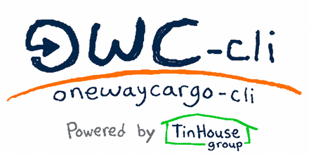

<p align="center">
  
</p>

<p align="center">
  
  
  
  
  
</p>

# oneway-cli

CLI no oficial para consultar trackings, órdenes y alertas de cuentas One Way Cargo desde la terminal.

<!-- TODO: agregar capturas/GIFs en docs/images/ -->

## Uso rápido

```bash
# Iniciar sesión
oneway-cli login

# Listar órdenes pendientes
oneway-cli orders

# Consultar un tracking
oneway-cli track 1Z19X22R0393685602

# Crear una alerta
oneway-cli create-alert 1Z19X22R0393685602 --type aereo
```

La primera vez que se ejecuta un comando protegido, el CLI solicita el correo y la contraseña de One Way Cargo. También se pueden definir las variables de entorno `ONEWAY_EMAIL` y `ONEWAY_PASSWORD` para ejecuciones no interactivas.

## Instalación

### Desde GitHub Releases

Instalar la rueda de la versión v0.3.0 directamente con `pipx`:

```bash
pipx install https://github.com/italovisconti/oneway-cli/releases/download/v0.3.0/oneway_cli-0.3.0-py3-none-any.whl
```

Alternativa con `pip`:

```bash
python -m pip install --user https://github.com/italovisconti/oneway-cli/releases/download/v0.3.0/oneway_cli-0.3.0-py3-none-any.whl
```

### Desde el código fuente

```bash
git clone https://github.com/italovisconti/oneway-cli.git
cd oneway-cli
uv tool install .
```

Alternativa con `pipx`:

```bash
pipx install .
```

Verificar la instalación:

```bash
oneway-cli --version
oneway-cli --help
```

### Autocompletado

Generar e instalar el script de autocompletado para el shell activo:

```bash
oneway-cli --install-completion
```

Reiniciar la terminal o recargar el shell para activarlo.

## Comandos principales

### Órdenes

```bash
oneway-cli orders
oneway-cli orders --all
oneway-cli orders --status "Por Pagar"
oneway-cli orders --json
```

Muestra las órdenes principales del panel de cuentas. Cada fila representa una orden principal e incluye warehouse, tracking, estado, peso/volumen, llegadas a USA y Venezuela, cargos, reempaques y el total que devuelve la página.

La columna `Cargos` lista cada cargo con su etiqueta, monto y estado. La columna `Reempaques` muestra, por cada paquete reempacado, su tracking junto al monto original tachado. Al final se imprime el total general reportado por el panel.

Por defecto se ocultan las órdenes en estado `pagado`. Usar `--all` para incluirlas. Usar `--status` para filtrar por un estado exacto o parcial. `--json` devuelve un JSON anidado con órdenes, cargos, reempaques y el total.

### Tracking

```bash
oneway-cli track 1Z19X22R0393685602
oneway-cli track 1Z19X22R0393685602 --json
```

Muestra llegada a Miami y Venezuela, peso, dimensiones e historial de movimientos del tracking.

### Alertas

```bash
oneway-cli alerts TRACKING
oneway-cli alerts TRACKING --json
```

Lista las alertas existentes del tracking.

### Crear alerta

```bash
oneway-cli create-alert TRACKING --type aereo
oneway-cli create-alert TRACKING --type maritimo --yes
oneway-cli create-alert TRACKING --type aereo --type compactar
```

Tipos disponibles:

| Tipo | Descripción |
| --- | --- |
| `aereo` | Alerta aérea |
| `maritimo` | Alerta marítima |
| `compactar` | Solicitar compactar un paquete |
| `verification` | Solicitar verificación de contenido |
| `quotation` | Solicitar cotización |
| `hold` | Solicitar retener un paquete |

`verification`, `quotation` y `hold` requieren `--accept-storage-fee` cuando aplique un cargo de almacenamiento.

El CLI consulta las alertas existentes antes de crear una y evita duplicados del mismo tipo. Después del envío vuelve a consultarlas para confirmar la creación. El tipo `repack` aún no está disponible porque requiere enviar varios trackings y sus consentimientos en una sola operación.

### Sesión

```bash
oneway-cli session-status
oneway-cli logout
oneway-cli logout --forget-credentials
```

`logout` elimina la sesión local, pero conserva el correo y la clave del llavero para poder iniciar sesión de nuevo. Con `--forget-credentials` también borra esas credenciales.

## Requisitos

- Python 3.11 o superior.
- Cuenta activa de One Way Cargo.
- Un llavero del sistema disponible: Keychain en macOS, Credential Manager en Windows o Secret Service en Linux.

## Arquitectura

```text
Typer CLI
  -> cliente HTTP curl_cffi
  -> One Way Cargo
  -> config platformdirs + credenciales keyring + caché privada de sesión
```

La autenticación respeta el campo temporal del formulario de login. Las operaciones protegidas detectan redirecciones al login y no declaran éxito hasta confirmar el resultado en el sitio. La sesión se almacena en caché durante una hora con renovación automática.

## Estado

El repositorio es público y las releases están disponibles en GitHub. PyPI es el siguiente canal de publicación opcional.

## Desarrollo

```bash
python -m pip install --user -e .
oneway-cli --help
```

El paquete usa `src/oneway_cli/`, `Typer` para los comandos, `Rich` para la salida, `BeautifulSoup` para analizar listados HTML y `curl_cffi` para las solicitudes autenticadas.

## Seguridad y privacidad

- No incluir la contraseña en scripts, historial de shell ni repositorios.
- El CLI usa la cuenta del usuario y realiza operaciones reales en el sitio.
- El sitio puede cambiar formularios o endpoints sin aviso.
- Revisar las condiciones de One Way Cargo antes de usar o redistribuir esta herramienta.

## Licencia

MIT. Consulta [LICENSE](LICENSE).

*Este proyecto no está afiliado, respaldado ni patrocinado por One Way Cargo. Es una herramienta independiente desarrollada por terceros.*
